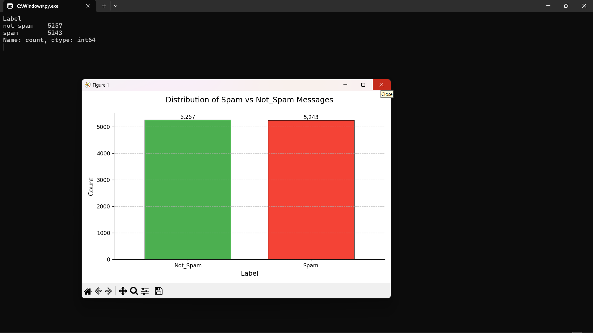
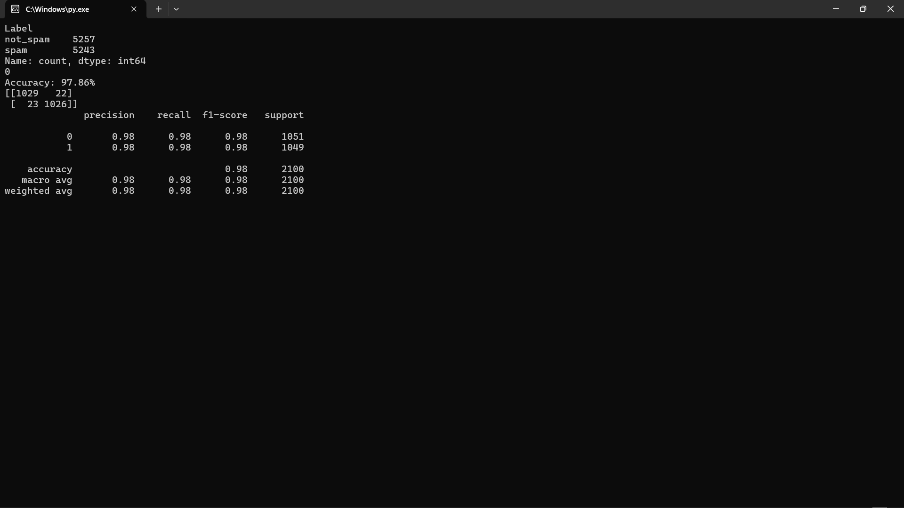

# MACHINE LEARNING MODEL IMPLEMENTATION

COMPANY : CODTECH IT SOLUTIONS

NAME : NIRAJ KUMAR YADAV

INTERN ID : CT04DF2492

DOMAIN : PYTHON PROGRAMMING

DURATION : FOUR WEEKS

MENTOR : NEELA SANTHOSH KUMAR

---

# 📧 Spam Email Classifier - Naive Bayes ML Model

This project is a basic implementation of a **Spam Email Classifier** using **Scikit-learn's Multinomial Naive Bayes** algorithm. It uses **TF-IDF vectorization** for feature extraction from email text and evaluates model performance with a confusion matrix and classification report.

---

## 🖼️ Screenshot




---

## 📁 Project Structure

```
.
├── machine_learning_model_implementation.py 
├── spam_dataset_realistic_10000.csv          # Dataset with 10,000 email samples
├── spam_classifier_model.pkl                 # Trained spam detection model (auto-saved)
├── vectorizer.pkl                            # Trained TF-IDF vectorizer (auto-saved)
├── README.md                                
├── requirements.txt       
├── OUTPUT_Screenshot/            
    ├── S1.png 
    └── S2.png                    
```

---

## 📊 Dataset Details

- **File**: `spam_dataset_realistic_10000.csv`
- **Columns**:
  - `Email Text`: Raw text of the email.
  - `Label`: `spam` or `not_spam`

---

## ⚙️ Features & Workflow

1. **Load Dataset**
2. **Data Cleaning & Preprocessing**
3. **Visualization**: Bar plot showing label distribution.
4. **Text Vectorization**: Using `TfidfVectorizer`.
5. **Model Training**: With `MultinomialNB`.
6. **Evaluation**:
   - Accuracy
   - Confusion Matrix
   - Classification Report
7. **Saving Model & Vectorizer**
8. **Spam Detection Function**: `detect_spam(email_text)` for real-time use.

---

## 🧪 Sample Usage

```python
print(detect_spam("Congratulations! You've won a lottery! Claim your prize now."))
# Output: Spam!

print(detect_spam("Please find the attached report for today's meeting."))
# Output: Not Spam!
```

---

## 📄 How to Use

1. **Run the script**:
   ```bash
   python machine_learning_model_implementation.py
   ```

3. **Output**:
    Two files would be automatically created... "spam_classifier_model.pkl" and "vectorizer.pkl" !! and a report on the terminal would appear as an analysis report !!
    First A Bar-Graph Picture Report will appear and after closing it, U'd get a full written report on your terminal.
   
---
    
---

## 📦 Requirements

Install dependencies using:

```bash
pip install -r requirements.txt
```

---

## 🔐 Note

Ensure your dataset file (`spam_dataset_realistic_10000.csv`) is present in the same directory as the script before running it.

---

## 👨‍💻 Author

Developed by **NIRAJ KUMAR YADAV**
